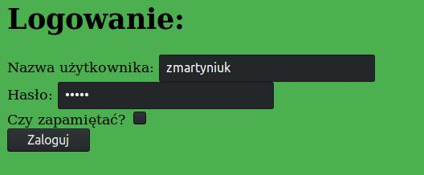
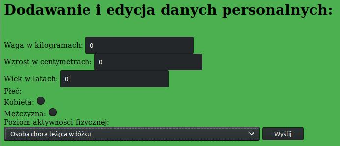
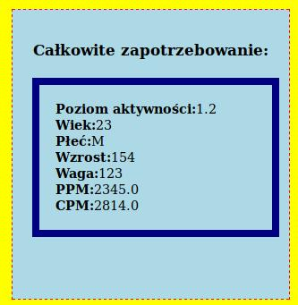
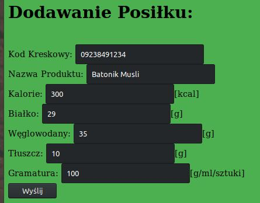
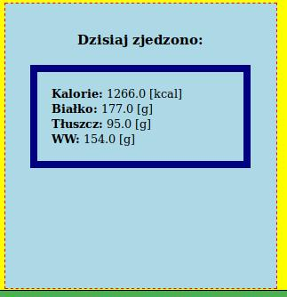
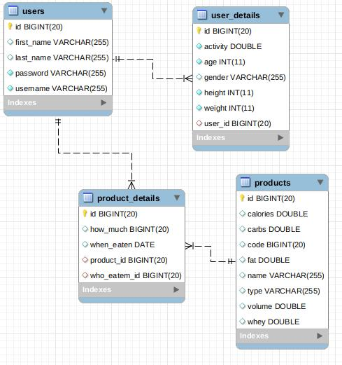

# DietManager
Diet Manager is an Web App to count calories and macro in everyday diet. Made as end project for CodersLab programming school.

## Used Technologies:

1. Java
1. Spring
1. Spring Boot
1. Spring Security
1. Hibernate
1. JSP
1. CSS
1. HTML

##Functionality:

App include registration and login form.

---

User can add his personal informations and recive how much calories and macros he can eat per day.

---

Everyday, user can scan bar code or type it into form. App will check does code exist in data base. If product is new user will be asked to add info about product. Then app show macros and calories for eaten product and ask how much user eaten. Finally all products eaten throug the day are shown in user profile.

---

Data bases structure:

## Future updates plans:
 - Add custom meal sizes (cup, spoon etc.)
 - Update of front-end
---
